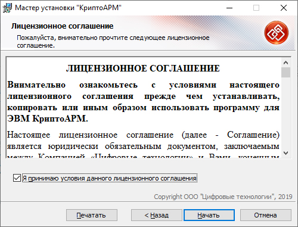

# Установка КриптоАРМ
Установка программы «КриптоАРМ» должна осуществляться пользователем, имеющим права Администратора системы.

Для установки программы «КриптоАРМ» запустите на исполнение файл Trusted- Desktop х.х.exe (где x.x. – номер версии). Откроется мастер установки «КриптоАРМ».

На этом шаге выберите вариант установки:
* **Быстрая установка** (рекомендуется).
* Быстрая установка программы, включает все дополнительные компоненты. Требует наибольшего объема места на диске.
* **Настраиваемая установка**
Установка с выбором дополнительных компонентов (модулей к программе). Рекомендуется для опытных пользователей.

Нажмите **Далее** для продолжения установки (или Отмена для выхода из мастера установки).
Следующий шаг зависит от того, какой вид установки вы выбрали.
При выборе быстрой установки вы сразу переходите на следующий шаг установки.
При выборе настраиваемой установки вы можете указать:
- какие из модулей нужно установить
- директорию на вашем компьютере, куда приложение будет установлено.

Ознакомьтесь с условиями лицензионного соглашения, в случае согласия отметьте соответствующий пункт и нажмите Начать.

Начнется установка программы на компьютер.
По окончании установки нажмите кнопку Готово. Для завершения установки перезагрузите компьютер.
После установки программы
в меню Пуск - Программы появится группа «КриптоАРМ», которая содержит меню вызова главного окна программы «КриптоАРМ», документации пользователя и программиста в формате PDF и меню мастера удаления программы.
в указанном при установке каталоге (по умолчанию в каталоге Program Files) будут созданы подкаталоги Digt\Trusted\Desktop.